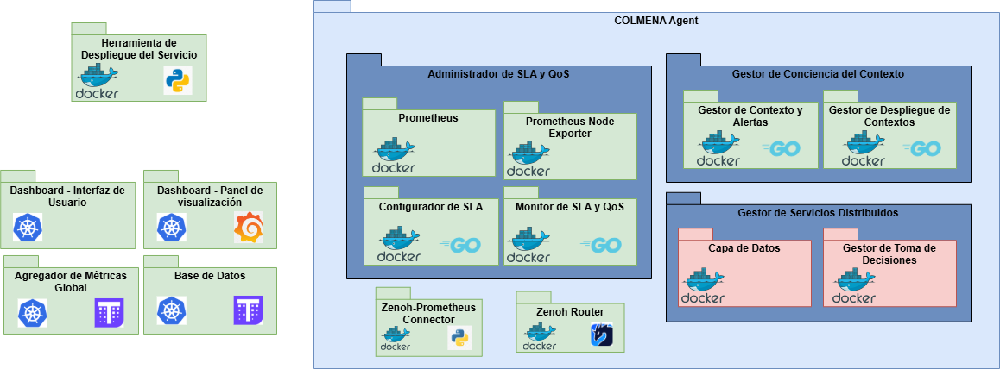

# COLMENA

The COLMENA project focuses on the paradigm shift from centralized computing in data centers to more distributed computing, empowering the computing capabilities of IoT devices and computing nodes at the edge of the network (Edge Computing paradigm). Data is generated mostly in this type of environment, at the device level, so that it can then be transmitted to more distant environments with greater processing capacity in order to group, clean and analyze it. The transmission of this data occurs through the network, which generates latency problems, especially when dealing with large volumes, while the existing capacities at the Edge or in the devices themselves are wasted. COLMENA focuses on this type of hyperdistributed environment (Swarm Computing paradigm) in which devices of all kinds interact intelligently and autonomously, taking advantage of resources more efficiently.

## Project Structure

The COLMENA platform is composed by the following components:

- Control Panel
  - Thanos
  - Grafana Dashboard

- Tools
  - [deployment tool](components/deployment-tool/README.md)
    - Python microservice

- AGENT
  - [sla manager](components/sla-manager-svc/README.md)
    - SLA management and assessment golang microservice
    - Prometheus
    - node_exporter
  - [context awareness manager](components/context-awareness-manager/README.md)
    - Golang microservice
  - [zenoh-prometheus-connector](components/zenoh-prometheus-connector/README.md)
    - Python microservice

## Installation and requirements

See [installation README.md](deploy/README.md)

[Agent and tools deployment](deploy/compose): Managed using Docker Compose.
[Control panel deployment](deploy/helm): Managed using Kubernetes.

## Architecture Reference




### REST APIs overview per component


## Sequence Diagrams

### Deployment


### Update Deployment


### Context Awareness Management


### SLA/SLO Management


## Contribution

Tech:

- 

Asset Owner:

- 

A Gitflow methodology is implemented within this repo. Proceed as follows:

1. Open an Issue, label appropriately and assign to the next planned release.
2. Pull the latest develop and branch off of it with a branch or PR created from GitHub as draft.
3. Commit and push frequently.
4. When ready, set PR as ready, tag team and wait for approval.

## License

ATOS and Eviden Copyright applies. Apache License

```text
/*
 * Copyright 20XX-20XX, Atos Spain S.A.
 * All rights reserved.
 *
 * Redistribution and use in source and binary forms, with or without
 * modification, are permitted provided that the following conditions are met:
 *
 *   * Redistributions of source code must retain the above copyright notice,
 *     this list of conditions and the following disclaimer.
 *   * Redistributions in binary form must reproduce the above copyright
 *     notice, this list of conditions and the following disclaimer in the
 *     documentation and/or other materials provided with the distribution.
 *   * Neither the name of the copyright holder nor the names of its
 *     contributors may be used to endorse or promote products derived from
 *     this software without specific prior written permission.
 *
 * THIS SOFTWARE IS PROVIDED BY THE COPYRIGHT HOLDERS AND CONTRIBUTORS "AS IS"
 * AND ANY EXPRESS OR IMPLIED WARRANTIES, INCLUDING, BUT NOT LIMITED TO, THE
 * IMPLIED WARRANTIES OF MERCHANTABILITY AND FITNESS FOR A PARTICULAR PURPOSE
 * ARE DISCLAIMED. IN NO EVENT SHALL THE COPYRIGHT OWNER OR CONTRIBUTORS BE
 * LIABLE FOR ANY DIRECT, INDIRECT, INCIDENTAL, SPECIAL, EXEMPLARY, OR
 * CONSEQUENTIAL DAMAGES (INCLUDING, BUT NOT LIMITED TO, PROCUREMENT OF
 * SUBSTITUTE GOODS OR SERVICES; LOSS OF USE, DATA, OR PROFITS; OR BUSINESS
 * INTERRUPTION) HOWEVER CAUSED AND ON ANY THEORY OF LIABILITY, WHETHER IN
 * CONTRACT, STRICT LIABILITY, OR TORT (INCLUDING NEGLIGENCE OR OTHERWISE)
 * ARISING IN ANY WAY OUT OF THE USE OF THIS SOFTWARE, EVEN IF ADVISED OF THE
 * POSSIBILITY OF SUCH DAMAGE.
 */
```
