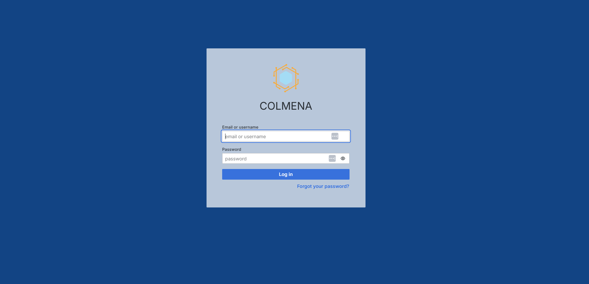
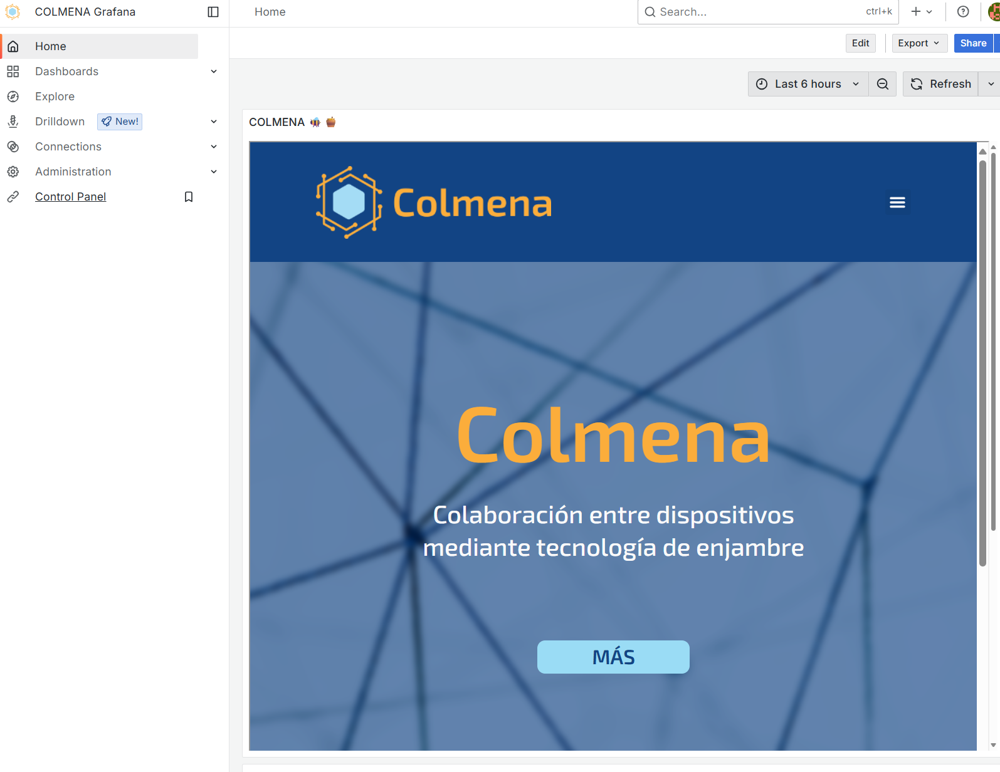

# Grafana Custome Docker Image
This is a custom Docker image of Grafana with the look and feel of the COLMENA project.
This custom Docker image is based on `grafana/grafana:latest` and applies the COLMENA project's branding look and feel. It includes a preloaded dashboard (Home), a custom configuration (`grafana.ini`, `grafana.db`), and replaces default logos, background, and icons with COLMENA visuals. Several UI elements such as footer links, search bar, and unused icons are removed. A custom "Control Panel" menu entry is added, and default unused data sources are deleted. Cloud and Enterprise sections are disabled, and data connections are turned off to streamline the interface. 


## How to test
### Option 1: Manually
````bash
docker  build  -t  grafana-colmena  .
docker  run  -d  -p  3000:3000  --name  grafana  grafana-colmena:latest
````
### Option 2: Using Makefile
````
make build
make run
````
You can stop, remove container and image using `make clean`

## Access

Go to: [http://localhost:3000](http://localhost:3000)

*  **Username:**  `admin`
*  **Password:**  `admin`

## Screenshots
### Login 


### Home
